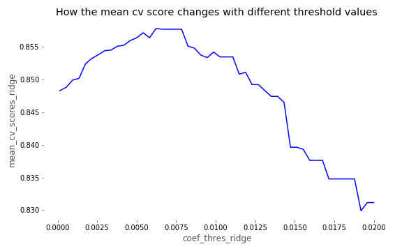
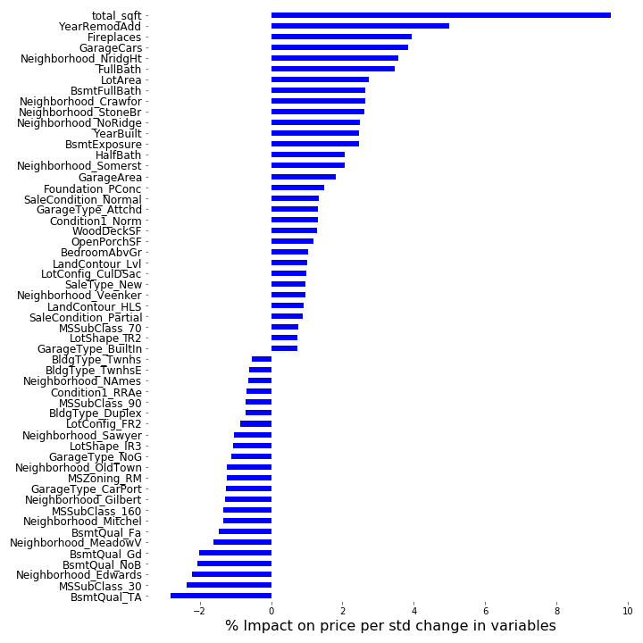
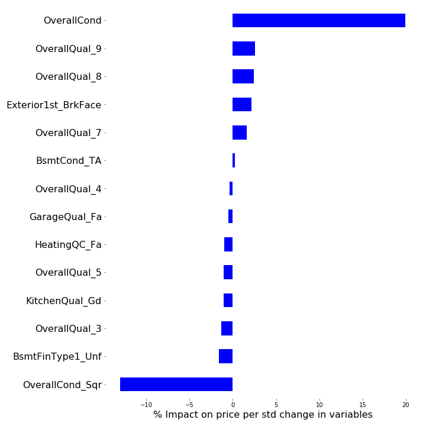

# Predicting House Prices

This project was undertaken from the perspective of a real estate company, interested in using data science to predict residential house prices based on fixed characteristics, such as square footage, as well as analysing the cost effectiveess of doing renovations, such as exterior house finishing, in order to identify houses that would return a profit. The `predicting_house_prices` notebook walks through the whole process in detail.

## Table of Contents:
- [Data](#Data)  
- [Part 1 - Predict residential house prices based on fixed characteristics](#part1)
- [Part 2 - Evaluating cost-effectiveness of renovations](#part2)
- [Conclusion](#conclusion)

---

<a name="Data"/>

## Data

The project uses the [Ames housing data recently made available on kaggle](https://www.kaggle.com/c/house-prices-advanced-regression-techniques). The `housing.csv` file contains the data and the full description of all of the features are detailed in `data_description.txt`.

<a name="part1"/>

## Part 1 

The first part of the project develop a model to reliably estimate the value of residential houses based on fixed characteristics such as square footage, bedrooms and so on. Characteristics that are renovatable are generally those that can be modified without having to undergo major construction on the house. For example, roof and exterior features, "Quality" metrics (kitchen quality) and so on. 

### Data Cleaning

- I firstly removed all of the columns that had 90% of the same values, including null values, as these columns would provide very little distinguishing information to predict house prices accurately. 
- After dealing with some incorrect entries, I filled in the null values in the remaining columns in numerous ways, depending on the context. 
    - For example, there were 259 entries with no linear feet of street connected to the property. Since properties would need to have some sort of street access, I filled them in the median value (vs mean due to skew) based on the type of property it was. 

### EDA & Feature Engineering 

I experimented with quite a few techniques here in order create better features and improve the score. For example: 
-  I plotted some of the numerical categorical variables to look for any non-linear relationships. For example, factorizing and then squaring Basement Exposure improved the score as getting a rating of 'Gd' was worth more than an increment of 1 vs a score of 'Av'. 
- Combining the square footage for basement, ground floor living area, 1st and 2nd floor to form 'total_sqft' as a seperate column and dropping the individual columns improved the score.

### Modelling

I tried Multiple Linear Regression with no regularisation, Lasso, Ridge and ElasticNet regularisation and compared them using the mean cross-validated (folds=5) R2 scores. Given the number of features and plenty of multicollinearity, regularisation was definitely needed as reflected in the scores.

After finding the optimal alpha value, I optimised Lasso and Ridge further by iteratively removed coefficients below a range of thresholds, refit the models and documented the change in score. This helped boost the score even further as for the Ridge model, it helped to boost the score by ~0.009 after dropping 62 columns that were below the optimal threshold 0.006221. 

#### Models and R2 scores:

- Linear regression, no regularisation: -2.681963e+23
- Lasso: 0.856770
- Ridge (the best model): 0.857827
- ElasticNet: 0.847308

#### Visualising the coefficients for the best Ridge model:

In order to improve the score, I decided to take the log of Sale Price to reduce the skew and ensure a normal distribution. This model is therefore a log-linear regression model, giving us the equation:

So the way to interpret the coefficients is that for each standard deviation rise in $X_i$, the value of $Y$ increase by $e^{\beta_i}$. For example, in the Ridge model (as shown in the picture), total_sqt had a coefficient of ~0.09. $e^{0.09} = ~1.094$. Meaning 1 std rise in total_sqt causes the sale price to multiply by ~1.094 or increase by ~9.41%. In all the optimal model coefficient visualisation plots, the coefficients have altered to represent the percentage impact on the price.

<a name="part2"/>

## Part 2 

The second part of the brief involved accessing the cost-effectiveness of renovatable features. One way of doing this would be to use the residuals from the previous model (error terms) and predict to what extent the renovatable features we discarded at the top can explain the discrepancies in the estimates vs the actual prices. The steps taken in cleaning, EDA, feature engineering and modelling mirror the proccess in part 1. 

### Modelling 

After optimising for alpha and the best coefficient cut-off threshold, Ridge was again marginally better than the other models. 

#### Models and R2 scores:

- Linear regression, no regularisation: -1.402297e+25
- Lasso: 0.189700
- Ridge (the best model): 0.198993
- ElasticNet: 0.143133

#### Visualising the coefficients for the best Ridge model:

From visualising the largest coefficients, we can see that the Overall Condition rating (accounts for ~20% increase in the part of the price accountable for renovatable features for 1 std rise in the rating) and having a brickface exterior finishing seem to contribute positively to explain the discrepancies in price for the estimated vs actual house prices. 

Given the context, it would be safe to assume that they contribute positively to overall house price and hence would be wise to renovate and upgrade the finishing of the home (as cost effectively as possible) to increase the rating of house (Condition or Quality metrics) to improve the sale price. However, given the low R2 score, more work may needs to done before we can put any weight on the findings of the second model.

<a name="conclusion"/>

## Conclusion

The first model was able to predict the price of residential houses reasonably well using the fixed characteristics, with a R2 score of 0.857827 using Ridge regularisation. Visualising the coefficients didn't reveal anything surprisingly, with the biggest positive influences on priceswhere the total square footage of the home, number of fireplaces, certan neighbourhoods and so on. 

In the second part, using residuals to estimate how much the renovatable features had an impact on price, the results were not great with the best R2 score at 0.198993. This low R2 score is not surprising as we are trying to estimate the residuals from an imperfect model where the residuals will have an element of irreducible amount of error which we cannot predict without overfitting.

A more accurate way of determining which renovatable features would play the biggest role in boosting the price and hence are cost-effective to carry out, would be to include them with the fixed characteristics in the first model, using regularisation to strip out the multi-collinearity issues, and hence be able assess with more confidence (in terms of R2 score) the percentage impact they would have on the property price.

